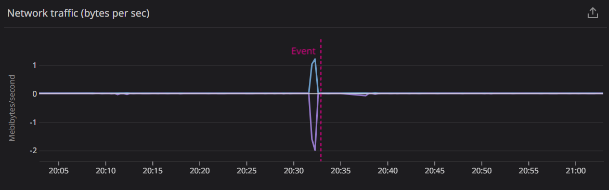
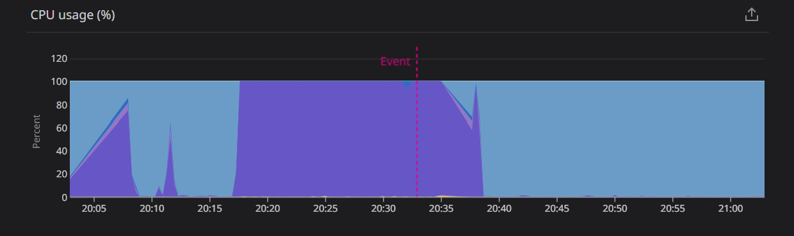
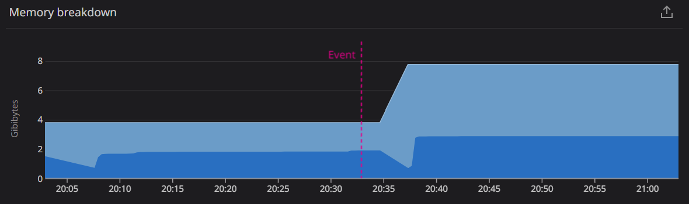
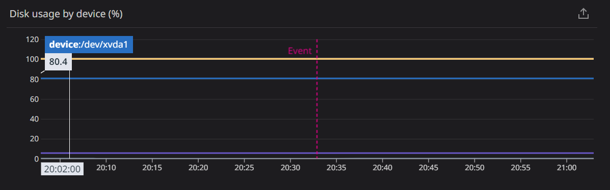
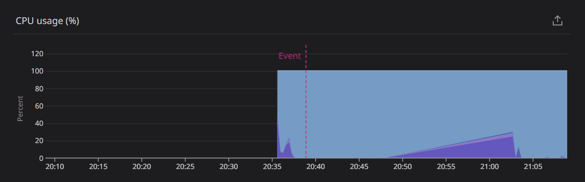
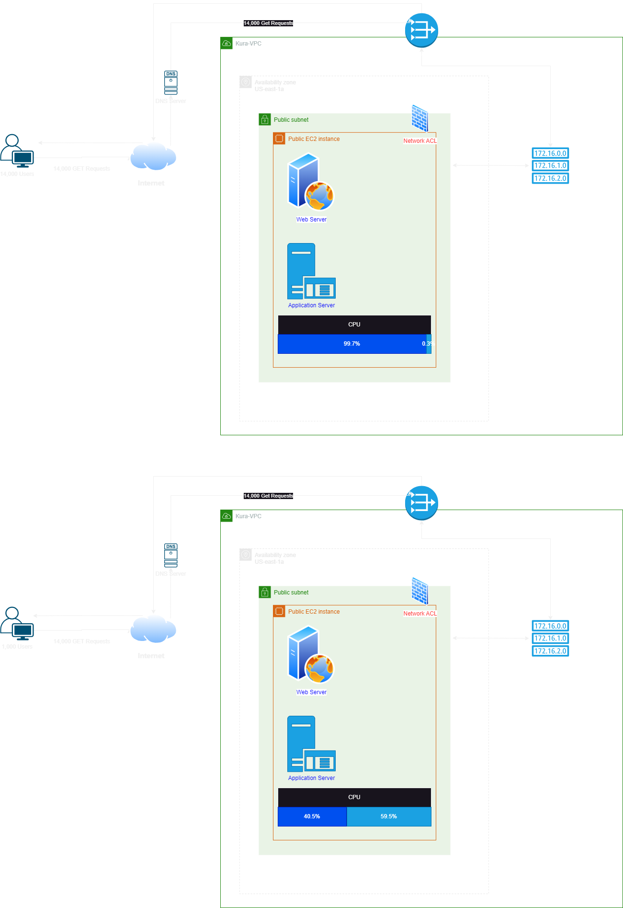

# Blitz 2 Exercise Documentation

## Introduction

This documentation provides an overview of the blitz-2 exercise conducted on our web server, including the observed performance metrics, the actions taken to resolve the identified issues, and the underlying purpose of the exercise.

### Purpose:
The primary purpose of the blitz-2 exercise was to monitor the performance of our web server under simulated high-traffic conditions and assess the impact on connectivity. By doing so, we aimed to:

1. Identify potential bottlenecks and weaknesses in our infrastructure.
2. Evaluate the need for performance optimizations.
3. Test the effectiveness of implementing a different instance type to improve connectivity and prevent any requests to time out or fail to be processed altogether.

## Scenario

In this exercise, we simulated a scenario in which our web server experienced a sudden surge in traffic, with 14000 concurrent user requests hitting our server simultaneously.

## Observations

### Initial Scenario :

**Connectivity:** 
- Users connected: 13,942
- Users timed out: 58
- Approximately 58 users experienced errors such as:
    -503 Service Unavailable
    -500 Internal Server Error

**Key Findings:**

- Network Traffic was observed under the simulated high-load conditions.
- Network Traffic went from a resting 3.0 kib/s (Kibibits per second) to a 1.2 mib/s (Mebibits per second) this means there has been a significant increase in the speed at which data is being transferred. Specifically, the data transfer rate has increased by a factor of 400.
  
  
- High CPU usage was observed under the simulated high load conditions.
- The CPU usage spiked to 99.7%, by contrast, while idle usage is 1.9%. This significant increase in CPU consumption can be attributed to the heightened processing demands resulting from the elevated data transfer rates mentioned earlier. The CPU is now tasked with managing packet processing, data encryption/decryption, and routing functions.
  
  
- Regular Memory usage was observed under the simulated high load conditions.
- Memory usage maintained between the range of .7gb to 2.8gb both values well below half usage of the total 8gb.  
  

-Disk usage was observed under the simulated high load conditions.
-Disk usage remained the same the whole time while the server was tested 
 

**Remediation**

1. Identifying Bottlenecks: discovered that the server was experiencing high CPU usage and a significant increase in network traffic during the blitz-2 exercise.

2. CPU Optimization: The server's hardware was upgraded to larger instances with more CPU cores to mitigate high CPU usage. We went from the T2.medium that has 2 vCPU cores and 4gb ram to T2.xlarge which has 4 vCPU cores  
     

### Diagram

